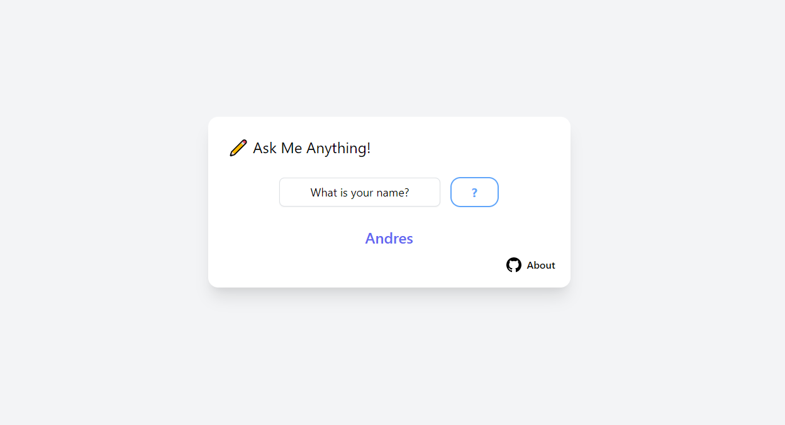

# The Ask Me Anything Answering Machine
This is a Vue.js component that utilizes the API from the great folks over at [🤗Hugging Face](https://huggingface.co).

 

#### Give it a context from which to find the answers in. 
(This is defined in the helper file src/robertaAPI.js)

#### And it will send out a request and get back to you with the answer based on the info you gave!

## RoBERTa
RoBERTa is the NLP model behind the API. It was developed by the guys at [Facebook AI](https://ai.facebook.com/blog/roberta-an-optimized-method-for-pretraining-self-supervised-nlp-systems/)

## Files
You can find the component @ src/answeringMachine.vue , and the helper file for the API @ src/robertaAPI.js.
You'll need to install axios in your project.

You're free to repurpose and modify it for your own projects!

## API Bearer Token
In order to use the API you'll have to sign up at https://huggingface.co. 

Once you've created your account, click on your profile on the top left and head to Settings -> API Token.

The kind people at Hugging Face allow you to use their API's under a free plan that has limited availabilty and takes a while to respond if you haven't made a request with your API key in a while.
This is why I've included a little snippet of code in the Component to send out a sample request to the API every 3 seconds until it returns succesfully. While it's doing this the component will show the "?" button as red and indicate that the API isn't yet available.
